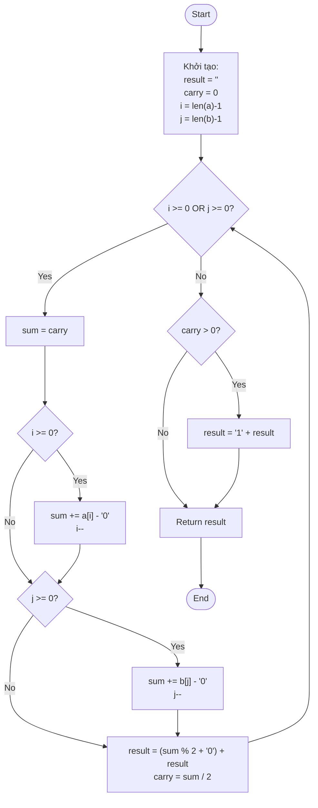

```mermaid

flowchart TD
 Start([Start]) --> Init["Khởi tạo:
    result = ''
    carry = 0
    i = len(a)-1
    j = len(b)-1"]
    
    Init --> Loop{"i >= 0 OR j >= 0?"}
    
    Loop -->|Yes| CalcSum["sum = carry"]
    
    CalcSum --> CheckI{"i >= 0?"}
    CheckI -->|Yes| ProcessA["sum += a[i] - '0'
    i--"]
    CheckI -->|No| CheckJ
    ProcessA --> CheckJ
    
    CheckJ{"j >= 0?"}
    CheckJ -->|Yes| ProcessB["sum += b[j] - '0'
    j--"]
    CheckJ -->|No| Update
    ProcessB --> Update
    
    Update["result = (sum % 2 + '0') + result
    carry = sum / 2"] --> Loop
    
    Loop -->|No| CarryCheck{"carry > 0?"}
    
    CarryCheck -->|Yes| AddCarry["result = '1' + result"]
    CarryCheck -->|No| Return["Return result"]
    
    AddCarry --> Return
    Return --> End([End])

```
