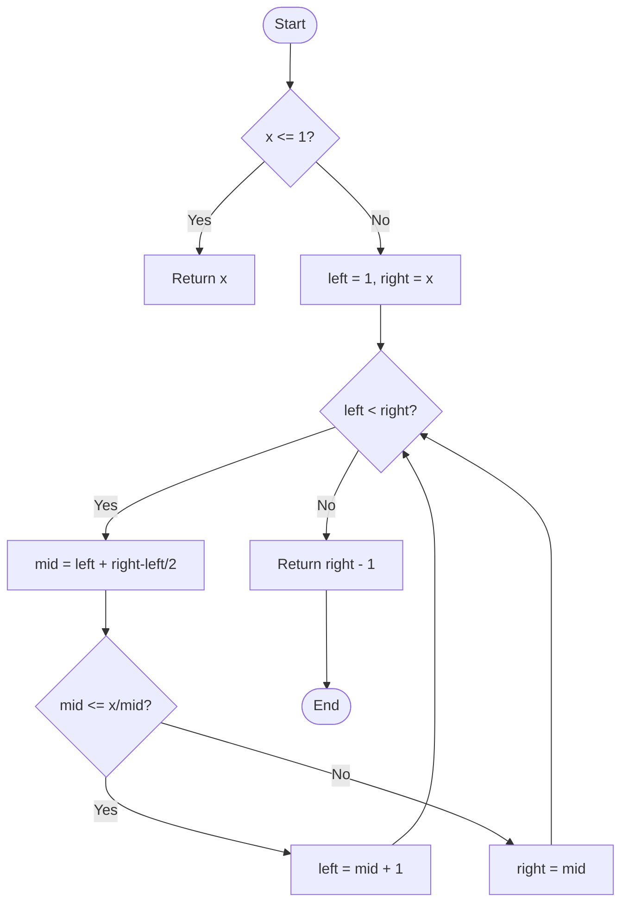

```mermaid

flowchart TD
    Start([Start]) --> CheckZeroOne{x <= 1?}
    CheckZeroOne -->|Yes| ReturnX[Return x]
    CheckZeroOne -->|No| Init[left = 1, right = x]
    Init --> WhileLoop{left < right?}
    WhileLoop -->|Yes| CalcMid[mid = left + right-left/2]
    CalcMid --> Compare{mid <= x/mid?}
    Compare -->|Yes| UpdateLeft[left = mid + 1]
    Compare -->|No| UpdateRight[right = mid]
    UpdateLeft --> WhileLoop
    UpdateRight --> WhileLoop
    WhileLoop -->|No| Return[Return right - 1]
    Return --> End([End])

```
